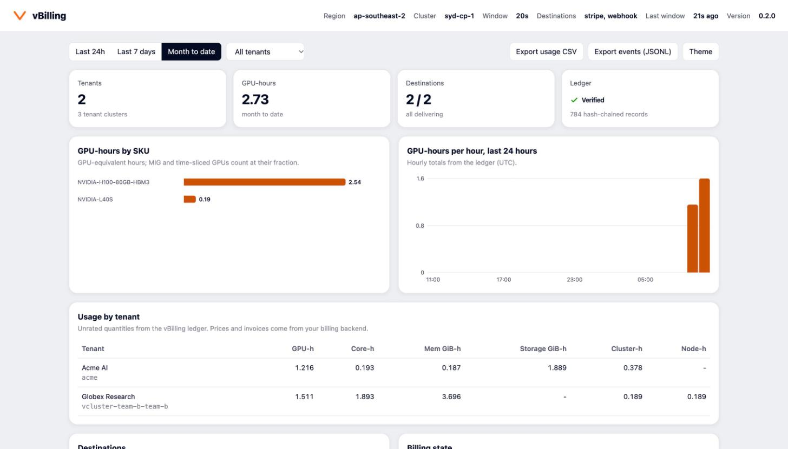

<p align="center">
  
</p>

<p align="center">
  <strong>Usage metering for AI Clouds running vCluster</strong><br>
  Meters tenant clusters to the second, keeps a durable, verifiable ledger, and ships reconcilable usage to Stripe, Metronome, Lago or your own pipeline.
</p>

<p align="center">
  
  <a href="LICENSE"></a>
  
</p>

---

vBilling is the **metering pipe**, not the billing engine. It turns what runs in your tenant clusters into canonical usage events. Your billing platform does the pricing, invoicing, tax and payments. vBilling makes sure every billable GPU-second reaches it exactly once, attributed to the right customer, region and SKU, and that you can prove it afterwards.

> vBilling lives in `vClusterLabs-Experiments`: it is an experimental project, not a supported vCluster Labs product.

## What's new in v0.2

- **Stripe and Metronome adapters.** Use Stripe Billing Meters on their own, or Metronome for rating with Stripe for payment, invoicing and tax. vBilling creates the Stripe customer and links it in Metronome.
- **Durable, hash-chained ledger.** Every window is committed atomically to disk before any backend sees it. If vBilling restarts or a backend has an outage, no usage is lost, and missed windows are backfilled.
- **Several destinations at once.** Each destination has its own cursor, so a down billing API never blocks your data platform feed.
- **Deterministic event IDs.** Retries, replays and two replicas all deduplicate downstream.
- **Second-level allocation metering.** GPU time is metered from container start to finish, including fractional GPUs (MIG mixed and single strategy, GKE GPU partitions, time-slicing including GKE time-sharing) and GPUs allocated through DRA ResourceClaims.
- **Every tenancy model.** Shared nodes and dedicated nodes are metered from the control plane cluster. Tenant clusters with their own nodes (vCluster Private Nodes, Auto Nodes, Standalone) are metered through their own API, with a read-only kubeconfig vCluster exports for vBilling. No node is ever billed twice.
- **Nothing slips between windows.** Pods and nodes deleted between two collections (short jobs, Auto Nodes scale-down) are billed until the second they were deleted.
- **Bill anything Prometheus knows.** Define billable metrics as PromQL (inference tokens from vLLM, any exporter's counter), or read vCluster Platform fleet observability with one preset.
- **Fair metering.** GPU time on NotReady or unhealthy nodes is not billed. It is recorded as auditable downtime instead.
- **Reconciliation API.** It recomputes usage from the ledger and compares it with what Stripe or Metronome recorded.
- **Billing-state enforcement.** Payment failures and spend alerts can label, annotate or soft-suspend tenant clusters.
- **Ingest API.** Accepts usage vBilling cannot see itself: inference tokens, Slurm accounting, storage and network exporters.
- **Built-in dashboard, Prometheus metrics, and CSV/JSONL exports.**
- **An end-to-end example on GKE.** [`examples/gke-gpu`](examples/gke-gpu) goes from an empty project to Stripe invoices: a time-sliced L4 tenant cluster, an A100 joined as a private node with the NVIDIA GPU Operator and MIG, DCGM through your own Prometheus, and a spot preemption billed to the second.

## Architecture

```
  Control plane cluster (one per region)                       Destinations
 ┌───────────────────────────────────────────────────────┐
 │ tenant clusters: team-a (shared) team-c (spot)        │
 │                  team-b (dedicated 8x H100)           │
 │        pods · PVCs · load balancers · nodes           │    ┌─► Stripe Billing Meters
 │                        │                              │    │
 │  ┌─────────────────────▼───────────────────────────┐  │    ├─► Metronome ──► Stripe (payments, tax)
 │  │ vBilling                                        │  │    │
 │  │  discover ─► meter window ─► ledger (PVC) ─► fan-out ───┼─► Lago
 │  │                 ▲            hash-chained       │  │    │
 │  │  ingest API ────┘            one cursor per     │  │    └─► webhook: CloudEvents to your data platform
 │  │  (tokens, Slurm, ...)        destination        │  │
 │  │                                                 │  │
 │  │  enforcement ◄── /webhooks ◄──────────────────────────── Stripe dunning, Metronome alerts
 │  │  label · annotate · admission policy            │  │
 │  │  API + dashboard: usage, exports, reconcile     │  │
 │  └─────────────────────────────────────────────────┘  │
 └───────────────────────────────────────────────────────┘
```

1. **Discover** tenant clusters (vCluster StatefulSets and Deployments, enriched from vCluster Platform when available) and group them into billing tenants.
2. **Meter** each closed window (60s by default, aligned to the wall clock) into canonical events.
3. **Commit** the window atomically to the ledger.
4. **Deliver** to every destination at least once, with deterministic IDs so the effect is exactly-once.
5. **Close the loop**: billing webhooks drive the tenant's billing state back onto its clusters.

## What gets metered

| Metric | Unit | How | Key dimensions |
|---|---|---|---|
| `vcluster_gpu_hours` | gpu-hours | Container start to finish, per second. MIG at slices/7 (A30: /4) under the single or mixed strategy and on GKE GPU partitions, time-sliced at 1/replicas. Dedicated nodes in whole GPUs | `sku`, `gpu_profile`, `capacity_type`, `billing_mode`, `zone` |
| `vcluster_cpu_core_hours` | core-hours | metrics-server usage, requests, or the larger of both (`CPU_MEMORY_BASIS`) | `capacity_type`, `billing_mode` |
| `vcluster_memory_gb_hours` | gib-hours | As CPU | `capacity_type`, `billing_mode` |
| `vcluster_private_node_hours` | node-hours | Whole nodes dedicated to a tenant cluster, per node | `sku` (SKU label or instance type), `capacity_type` |
| `vcluster_storage_gb_hours` | gib-hours | Bound PVCs synced from the tenant cluster | `sku` = storage class |
| `vcluster_instance_hours` | hours | Control plane hours while ready (not while provisioning or asleep) | `tenant_class` |
| `vcluster_lb_hours` | hours | LoadBalancer services with an assigned address | |
| `vcluster_network_egress_gb` | gib | Prometheus, evaluated at the window end (configurable PromQL) | |
| `vcluster_gpu_utilization` | util-hours | DCGM via Prometheus (`namespace` or `exported_namespace` labels; GPUs in MIG mode by instance engine activity), or your `GPU_UTIL_QUERY`. Informational: never sent to Stripe or Metronome | `gpu_type` |
| `vcluster_gpu_downtime_hours` | gpu-hours | Allocated GPU time on NotReady/unhealthy nodes, and GPUs a dedicated or private node has installed but cannot allocate (a driver restarting after a reboot or a MIG change). Informational: an audit trail of credits | `gpu_type`, `node` |
| custom (`CUSTOM_METRICS`) | yours | Ingest API: inference tokens, Slurm GPU-hours, ... | yours |

Every event carries `tenant`, `region`, `project`, `sku`, `resource_id`, `tenant_cluster`, the window, and a stable ID. Schema: [`docs/schema/usage-event.v1.json`](docs/schema/usage-event.v1.json).

```json
{
  "schema_version": "vbilling.usage/v1",
  "id": "vb1_d26414a201f1c0e1a4c1b0f0b7e6c2aa",
  "tenant": "acme",
  "metric": "vcluster_gpu_hours",
  "quantity": 0.027222222,
  "unit": "gpu-hours",
  "window_start": "2026-10-05T09:58:00Z",
  "window_end": "2026-10-05T09:58:20Z",
  "region": "ap-southeast-2",
  "project": "training",
  "sku": "NVIDIA-H100-80GB-HBM3",
  "resource_id": "vcluster-team-a-team-a",
  "dimensions": {
    "tenant_cluster": "vcluster-team-a-team-a", "gpu_type": "NVIDIA-H100-80GB-HBM3",
    "gpu_profile": "full", "capacity_type": "on-demand", "billing_mode": "shared",
    "tenant_class": "public", "zone": "syd-1a"
  },
  "properties": {"gpu_devices": 6, "pods": 3, "backfilled": true},
  "source": "collector",
  "recorded_at": "2026-10-05T09:59:08Z"
}
```

*(That event is real output from the end-to-end test. A new 2-GPU pod started 11 seconds into the window while vBilling was down, and the backfill billed exactly its 9 seconds.)*

### Metering rules that protect tenants

- **Billing starts when a container starts**, not when the pod is created, so image pulls and scheduling are free. It stops when the last container finishes.
- **Hardware downtime is not billed.** GPU time on a node that is NotReady, or carries a taint listed in `UNHEALTHY_NODE_TAINTS`, becomes `vcluster_gpu_downtime_hours` instead of `vcluster_gpu_hours`. So does a node billed whole whose GPUs are installed (GPU Feature Discovery's `nvidia.com/gpu.count`) but not allocatable, for example while the driver rebuilds after a reboot.
- **Provisioning and sleep are free.** Control plane hours accrue only while the tenant cluster has a ready replica.
- **No double billing.** Pods on a tenant's own dedicated nodes are covered by the node allocation. The tenant cluster's own control plane pods and data PVCs are covered by instance hours (set `METER_CONTROL_PLANE=true` to bill them as well).
- **No invented usage.** Backfilled windows include only what is knowable from object lifetimes (allocations, requests). Sampled usage (metrics-server CPU, egress) is never extrapolated.
- **Deleted is not free, and not overbilled.** A pod or node deleted between collections is billed until it was deleted. A deletion noticed only after a watch reconnects is dated to the last collection that still saw it, so an outage can only under-bill.

## Tenancy models

| Tenancy model | Where workloads run | How vBilling meters it |
|---|---|---|
| Shared nodes | Control plane cluster nodes, pods synced by vCluster | From the control plane cluster: pods, volumes, load balancers (`billing_mode=shared`) |
| Dedicated nodes | Control plane cluster nodes reserved for one tenant cluster | Whole node: node-hours, whole GPUs, CPU and memory capacity (`billing_mode=dedicated_node`) |
| Private Nodes, Auto Nodes | Machines joined to the tenant cluster itself; nothing is synced to the control plane cluster | Through the tenant cluster's own API: each private node billed whole (`billing_mode=private_node`), plus the tenant cluster's volumes and load balancers. `PRIVATE_NODE_BILLING=usage` bills the pods on them instead |
| Standalone, or any cluster elsewhere | No control plane cluster | Through a kubeconfig listed in `TENANT_CLUSTERS_FILE`, like private nodes |

A node the tenant cluster's API reports is billed as a private node only if the control plane cluster does not have it and it is not one of vCluster's placeholder nodes (`vcluster.loft.sh/fake-node`). Shared tenant clusters are therefore never billed twice, even with tenant API access configured. Label a node `vbilling.vcluster.com/billable=false` to exempt hardware the tenant owns.

**Least-privilege access.** vBilling reads one Secret per tenant cluster, `vbilling-kubeconfig` in its namespace, and its RBAC is pinned to that Secret name. vCluster writes it with a read-only service account:

```yaml
# vcluster.yaml (vCluster 0.36+)
exportKubeConfig:
  additionalSecrets:
    - name: vbilling-kubeconfig
      serviceAccount:
        name: vbilling-reader
        namespace: kube-system
        clusterRole: vbilling-reader
experimental:
  deploy:
    vcluster:
      manifests: |-
        apiVersion: rbac.authorization.k8s.io/v1
        kind: ClusterRole
        metadata:
          name: vbilling-reader
        rules:
          - apiGroups: [""]
            resources: [nodes, pods, persistentvolumeclaims, services]
            verbs: [get, list, watch]
          - apiGroups: [resource.k8s.io]
            resources: [resourceclaims, resourceslices]
            verbs: [get, list]
          - apiGroups: [metrics.k8s.io]
            resources: [pods]
            verbs: [get, list]
```

vCluster exports kubeconfigs for `localhost`; vBilling connects to the tenant cluster's Service instead and verifies TLS against `<name>.<namespace>`. `TENANT_ADMIN_FALLBACK=true` also accepts the admin kubeconfig (`vc-<name>`), which requires giving vBilling read access to Secrets.

**Outages.** If a tenant cluster's API cannot be read, the rest of the fleet is still metered, and the missed windows are filled as soon as it answers (up to `MAX_BACKFILL`). Fills are late ledger events deduplicated by ID, so a repeated fill never bills twice.

## Billing backends

Select one or more with `ADAPTERS` (Helm: `adapters`).

| Adapter | What vBilling does | Pricing lives in |
|---|---|---|
| `stripe` | Creates [Billing Meters](https://docs.stripe.com/billing/subscriptions/usage-based) and posts meter events. Meters are split per SKU (`STRIPE_SPLIT_METERS_BY`) because Stripe meters cannot price on dimensions. Customers are created idempotently and never duplicated. Optionally subscribes tenants to prices tagged `metadata[vbilling_plan]`. Reconciles via meter event summaries. | Stripe prices on each meter |
| `metronome` | Creates customers with the tenant ID as ingest alias. Creates SUM billable metrics with one compound group key (`region, sku, capacity_type, billing_mode, tenant_cluster`). Ingests events and optionally creates a contract per tenant from a rate card. Reconciles via `/v1/usage`. | Metronome rate cards (pricing group keys) |
| `metronome` + `METRONOME_STRIPE_LINK=true` | Also creates the tenant's Stripe customer and links it in Metronome, so **Metronome rates and Stripe collects payment, invoices and tax**. | Metronome |
| `lago` | Customers, subscriptions and the default plan, plus events whose dimensions are properties for Lago charge filters. | Lago plans and charges |
| `webhook` | Signed CloudEvents 1.0 batches (`application/cloudevents-batch+json`), including tenant and catalog events. Use it to feed a data platform, Kafka bridge or homegrown rating engine. | wherever you send it |
| `noop` | Logs events (dry run). | n/a |

Stripe now steers new usage-based integrations toward Metronome, which Stripe acquired in January 2026. Both paths are supported here: Billing Meters for straightforward pay-as-you-go, Metronome for dimensional pricing, commits, credits and multi-currency rate cards.

## Quick start

Images for `linux/amd64` and `linux/arm64` are published to `ghcr.io/vclusterlabs-experiments/vbilling`, the chart's default. Keep billing keys in Secrets, never in `--set` flags or values files:

```bash
git clone https://github.com/vClusterLabs-Experiments/vbilling.git && cd vbilling
kubectl create namespace vbilling-system
```

**Stripe (test mode)**

```bash
kubectl -n vbilling-system create secret generic vbilling-stripe --from-file=api-key=./stripe-test-key
helm upgrade --install vbilling deploy/helm/vbilling -n vbilling-system \
  --set adapters='{stripe}' --set stripe.existingSecret=vbilling-stripe \
  --set region=ap-southeast-2 --set clusterName=syd-1
```

vBilling creates one meter per metric (and per SKU as it sees them). Attach metered prices to the meters you want to charge for. To have vBilling subscribe each new tenant automatically, tag those prices with `metadata[vbilling_plan]=vcluster-standard` and set `stripe.autoSubscribe=true`.

**Metronome rating, Stripe payments**

```bash
kubectl -n vbilling-system create secret generic vbilling-metronome --from-file=api-token=./metronome-token
kubectl -n vbilling-system create secret generic vbilling-stripe --from-file=api-key=./stripe-live-key
kubectl -n vbilling-system create secret generic vbilling-webhook --from-file=secret=./webhook-secret
helm upgrade --install vbilling deploy/helm/vbilling -n vbilling-system \
  --set adapters='{metronome,webhook}' \
  --set metronome.existingSecret=vbilling-metronome --set metronome.rateCard=payg-aud \
  --set metronome.stripeLink=true --set stripe.existingSecret=vbilling-stripe \
  --set webhook.url=https://data.example.com/usage --set webhook.existingSecret=vbilling-webhook \
  --set region=ap-southeast-2
```

In Metronome, add products on the vBilling billable metrics with `pricing_group_key: ["region","sku","capacity_type"]` to price H100 differently from L40S, Sydney differently from Melbourne, and spot or preemptible at a flat discount. Rate cards carry the currency (AUD and NZD are supported natively).

**Shared and private GPU nodes on GKE**: [`examples/gke-gpu`](examples/gke-gpu) is a complete setup, from an empty project to Stripe invoices: a time-sliced L4 tenant cluster, an A100 joined as a vCluster private node, DCGM through Prometheus, and the manifests, values and commands for each step. Also on the [docs site](https://vclusterlabs-experiments.github.io/vbilling/example-gke.html).

**Lago (local demo)**: `deploy/lago/docker-compose.yml` runs Lago locally. See [docs/getting-started.html](docs/getting-started.html).

Then:

```bash
kubectl -n vbilling-system port-forward svc/vbilling 8080
# dashboard: http://localhost:8080/
curl -s localhost:8080/api/v1/status | jq '.destinations'           # delivery health
curl -s 'localhost:8080/api/v1/usage?group_by=tenant,sku' | jq      # line items
```



## Tenants, projects and metadata

By default every tenant cluster is its own billing customer, with ID `vcluster-<namespace>-<name>` (the v0.1 format). Set labels or annotations on the tenant cluster's StatefulSet, its namespace, or its vCluster Platform `VirtualClusterInstance` (later sources win):

| Key (`vbilling.vcluster.com/...`) | Effect |
|---|---|
| `tenant` | Billing customer ID. Several tenant clusters can share one customer. |
| `display-name`, `email`, `currency` | Customer details sent to the backend |
| `project` | Cost attribution (defaults to the vCluster Platform project) |
| `tenant-class` | e.g. `public`, `enterprise`, `government`, `dev`. Stamped on events for pricing. |
| `plan` | Lago plan, Stripe plan tag, or Metronome rate card alias/ID |
| `stripe-customer-id`, `metronome-customer-id` | Pin an existing customer instead of creating one |
| `exclude` | `"true"` stops metering this tenant cluster |

`TENANT_SOURCE=project` maps every tenant cluster in a vCluster Platform project to one customer (`project-<name>`). `METER_BY_NAMESPACE=true` adds the namespace inside the tenant cluster as a dimension, so tenants can run their own internal chargeback.

On nodes, `vbilling.vcluster.com/capacity-type` (`on-demand`, `spot`, `preemptible`, `reserved`) and an optional SKU label (`SKU_LABEL`) take precedence over cloud-provider labels. Nodes become **dedicated** to a tenant cluster with `vbilling.vcluster.com/tenant-cluster=<id or name>`, `vcluster.loft.sh/managed-by=<namespace or name>`, or the `VCLUSTER_NODE_LABEL` pattern.

## Durability and correctness

| Guarantee | How |
|---|---|
| No usage lost on restart, upgrade or backend outage | Windows are committed to an fsynced, append-only ledger on a PVC before delivery. Each destination has a persisted cursor. On restart, missed windows (up to `MAX_BACKFILL`, default 6h) are backfilled from object lifetimes. |
| No duplicates | Event IDs are a hash of the event's identity (tenant, metric, window, dimensions), never of its quantity. Stripe dedupes on `identifier`, Metronome on `transaction_id` (34 days), Lago on `transaction_id`. A window can never be committed twice. |
| Half-written windows never escape | A window is a single write plus fsync ending in a commit record. A torn or uncommitted tail is truncated on startup and collected again. |
| Tamper evidence | Every ledger record is SHA-256 chained to the previous one. `GET /api/v1/ledger/verify` re-hashes the whole retained ledger. |
| Bad events don't block good ones | Payloads a backend rejects are isolated (partial-batch errors, or bisection) and parked as dead letters. Auth errors, rate limits and outages are retried with backoff; they are never dead-lettered. |
| Provable totals | `GET /api/v1/reconcile` recomputes each tenant's usage from the ledger and compares it with what Stripe or Metronome recorded. Dead letters are accounted for. |
| Tenant API outages do not lose usage | A tenant cluster whose own API is unreachable is recorded as a gap (persisted under `DATA_DIR`). Once it answers, exactly the missed windows are metered and appended as late events, deduplicated by ID. |
| A wrong customer is never billed | Customer search results must carry the tenant's exact metadata. Discovery errors never offboard tenants. A tenant must be gone for `OFFBOARD_GRACE` before `RemoveTenant` runs, and customers are never deleted. |

Running two replicas (each with its own PVC) is safe for delivery: both compute the same deterministic IDs, so backends keep the first copy.

## Regions and data sovereignty

Run one vBilling per control plane cluster and set `region` (for example `ap-southeast-2`, `syd-1`, `mel-1`). Every event, ledger record and billing state stays in that region's cluster. `GET /api/v1/status` reports the region, and each destination is a separately configured, documented data flow. Stripe and Metronome are hosted outside many jurisdictions (Metronome's public docs describe no regional hosting), so a sovereign region can choose to:

- keep the full-fidelity ledger and the webhook feed in-region and send only billing quantities offshore
- pin customer IDs and keep names and emails out of usage events (they never contain PII; tenant IDs are yours to choose)
- run Lago or its own pipeline in-region instead

## Billing-state enforcement

Point Stripe webhooks at `/webhooks/stripe` (`STRIPE_WEBHOOK_SECRET`) and Metronome notifications at `/webhooks/metronome` (`METRONOME_WEBHOOK_SECRET`). Signatures are verified: Stripe's `t=…,v1=…` scheme, and Metronome's HMAC over `X-Metronome-Date` and the body.

| Event | State |
|---|---|
| `invoice.payment_failed`, subscription `past_due` | `delinquent` |
| subscription `unpaid` / `canceled` / deleted | `suspended` |
| `billing.alert.triggered`, Metronome `alerts.*` (spend, usage, low credit or commit balance) | `warning` |
| `invoice.paid`, subscription `active` | `active` |

Override any mapping with `ENFORCEMENT_RULES`, for example `alerts.spend_threshold_reached=suspended` for a hard spend cap.

`ENFORCEMENT_MODE` controls what happens:
- **`observe`** (default): record the state only. It appears in the API, metrics and dashboard.
- **`annotate`**: also annotate the tenant cluster, label its namespace `vbilling.vcluster.com/billing-state`, and emit a Kubernetes event.
- **`enforce`**: also label suspended namespaces `vbilling.vcluster.com/suspended=true`. With `enforcement.admissionPolicy.enabled=true` (Kubernetes 1.30+), a ValidatingAdmissionPolicy then denies **new** pods in those namespaces. Running workloads keep running, the tenant sees the reason as a sync error inside their tenant cluster, and a paid invoice lifts it automatically.

Metronome does not emit webhooks for Stripe payment failures, so in Metronome + Stripe mode, send Stripe's webhooks to vBilling as well.

## Custom usage: tokens, Slurm, storage, network

Declare metrics with `CUSTOM_METRICS="code:unit[:key|key],..."` and push closed windows with a bearer token:

```bash
curl -X POST localhost:8080/api/v1/events -H "Authorization: Bearer $INGEST_TOKEN" -H "X-VBilling-Client: model-gateway" -d '{
  "events": [{"tenant": "acme", "metric": "inference_output_tokens", "quantity": 1250000,
              "window_start": "2026-10-05T10:00:00Z", "window_end": "2026-10-05T10:01:00Z",
              "dimensions": {"model": "llama-3.3-70b"}}]}'
```

Events are validated, stamped with the region, deduplicated (send your own `id`, or let vBilling derive one from the identity), committed to the ledger, and fanned out like collector events. Billing backends create meters and metrics for custom metrics at bootstrap.

### Metrics from Prometheus

`PROMETHEUS_METRICS_FILE` (Helm: `prometheus.metrics`) defines metrics as PromQL, evaluated for every tenant cluster at each window end. Result labels listed in `dimensions` become event dimensions and pricing group keys:

```yaml
- code: inference_output_tokens
  name: Inference output tokens
  unit: tokens
  billable: true
  dimensions: [model_name]
  sku: model_name
  query: sum by (model_name) (increase(vllm:generation_tokens_total{namespace="{{namespace}}"}[{{window}}]))
```

Templates: `{{namespace}}`, `{{vcluster}}`, `{{instance}}` (vCluster Platform instance), `{{project}}`, `{{tenant}}`, `{{tenant_cluster}}`, `{{window}}` (e.g. `60s`), `{{window_seconds}}` (e.g. `60`).

Billing on DCGM fields takes two precautions. The exporter refreshes values every 30 seconds by default (`DCGM_EXPORTER_INTERVAL`), so `increase()` over a window that short can read zero: integrate a gauge instead. And device-level fields (power, energy, framebuffer) repeat on every MIG instance of a GPU, so keep one series per GPU (`UUID`) before summing. GPU energy per kWh, for GPUs a tenant has to itself:

```yaml
- code: gpu_energy_kwh
  name: GPU energy
  unit: kWh
  billable: true
  dimensions: [modelName]
  sku: modelName
  query: sum by (modelName) (max by (modelName, UUID, gpu, Hostname, hostname) (avg_over_time(DCGM_FI_DEV_POWER_USAGE{vcluster="{{vcluster}}"}[{{window}}]))) * {{window_seconds}} / 3.6e6
```

Tenant clusters with private nodes run DCGM inside the tenant cluster, so the control plane cluster's Prometheus never scrapes it. Ship it with a Prometheus agent (or OpenTelemetry collector) that remote-writes to your Prometheus with an external label naming the tenant cluster, as `vcluster` does above, and select on that label in `GPU_UTIL_QUERY`, `GPU_COUNT_QUERY` and your metrics. With vCluster Platform fleet observability, the preset below does this for you.

### vCluster Platform fleet observability

vCluster Platform 4.11+ collects metrics from every tenant cluster, private nodes included, with an OpenTelemetry collector that pushes through the Platform's write gateway. The gateway stamps each series with `vcluster_platform_instance` and `vcluster_platform_project` from the collector's access key, after removing any such labels a tenant sent. `PROMETHEUS_PRESET=vcluster-platform` points egress and DCGM GPU utilization at those labels; set `PROMETHEUS_URL` to the fleet Prometheus (or the query proxy, with a metrics access key in `PROMETHEUS_HEADERS`).

## HTTP API

| Endpoint | Purpose |
|---|---|
| `GET /` | Dashboard (embedded; no external assets, works air-gapped) |
| `GET /healthz`, `GET /readyz`, `GET /metrics` | Probes and Prometheus metrics |
| `GET /api/v1/status` | Region, destinations (cursor, lag, failures, dead letters), ledger stats |
| `GET /api/v1/usage?from&to&group_by=tenant,sku,region,day&format=csv` | Unrated line items (filters: `tenant`, `metric`, `project`, `region`, `sku`, `cluster`) |
| `GET /api/v1/events?from&to&format=jsonl\|csv` | Raw event export |
| `POST /api/v1/events` | Ingest custom usage (`INGEST_TOKEN`) |
| `GET /api/v1/reconcile?from&to&destination` | Ledger vs. backend totals (default: previous UTC day) |
| `GET /api/v1/ledger/verify` | Hash-chain verification |
| `GET /api/v1/destinations`, `GET …/{name}/dead-letters`, `POST …/{name}/dead-letters/replay`, `POST …/{name}/cursor` | Delivery operations |
| `GET /api/v1/tenants`, `GET /api/v1/billing-states`, `PUT /api/v1/billing-states/{tenant}` | Tenants and billing state |
| `POST /webhooks/stripe`, `POST /webhooks/metronome` | Billing signals |

`API_TOKEN` protects everything under `/api` (bearer). Keep the Service internal, or put it behind your portal.

## Observability

Notable metrics on `/metrics`:
- **Delivery:** `vbilling_events_delivered_total{destination}`, `vbilling_delivery_failures_total{destination}`, `vbilling_events_dead_lettered_total{destination}`, `vbilling_destination_lag_records`, `vbilling_destination_lag_seconds`, `vbilling_destination_ready`
- **Metering:** `vbilling_events_metered_total`, `vbilling_backfilled_windows_total`, `vbilling_last_window_end_timestamp_seconds`, `vbilling_nodes_down`
- **Tenants:** `vbilling_tenant_billing_state{tenant,state}`
- **Ledger:** `vbilling_ledger_bytes`

Alert on rising lag, dead letters, or a stale last window.

## Configuration

| Variable (Helm value) | Default | |
|---|---|---|
| `ADAPTERS` (`adapters`) | `lago` | Comma-separated destinations. `ADAPTER` (v0.1) still works. |
| `REGION` (`region`), `CLUSTER_NAME` (`clusterName`) | `default`, `control-plane` | Stamped on every event |
| `DATA_DIR` | `/var/lib/vbilling` | Ledger and adapter state (PVC in the chart) |
| `RETENTION` (`persistence.retention`) | `168h` | Ledger retention once every destination has consumed it |
| `COLLECTION_INTERVAL` | `60s` | Window size; must divide an hour |
| `MAX_BACKFILL`, `OFFBOARD_GRACE` | `6h`, `1h` | |
| `CPU_MEMORY_BASIS` | `usage` | `usage`, `requests` or `max` |
| `METER_CONTROL_PLANE`, `METER_BY_NAMESPACE` | `false` | |
| `GPU_RESOURCES` | `nvidia.com/gpu,amd.com/gpu` | MIG (`nvidia.com/mig-*`) and `nvidia.com/gpu.shared` are always detected |
| `SKU_LABEL`, `CAPACITY_TYPE_LABEL` | `""`, `vbilling.vcluster.com/capacity-type` | |
| `UNHEALTHY_NODE_TAINTS` | `node.kubernetes.io/not-ready,node.kubernetes.io/unreachable` | Add your GPU health taints |
| `TENANT_SOURCE`, `DEFAULT_TENANT_CLASS`, `PLATFORM_CLUSTER` | `cluster` | |
| `PROMETHEUS_URL`, `EGRESS_QUERY` | | Any Prometheus HTTP API (Prometheus, Thanos, Mimir, VictoriaMetrics). Egress and GPU utilization. Templates use `{{namespace}}`, `{{vcluster}}`, `{{window}}` |
| `GPU_UTIL_QUERY`, `GPU_COUNT_QUERY` | DCGM | Replace the utilization queries (same templates, results grouped by `modelName` or `gpu_type`); `none` disables utilization |
| `PROMETHEUS_HEADERS`, `PROMETHEUS_BEARER_TOKEN_FILE` | | Query API auth: `Name=value,...` headers (e.g. `X-Scope-OrgID`, `Authorization`) and a token file re-read per query. Basic auth also works in the URL |
| `PROMETHEUS_PRESET` | | `vcluster-platform`: vCluster Platform fleet observability label selectors |
| `PROMETHEUS_METRICS_FILE` | | Metrics defined by PromQL (see Metrics from Prometheus) |
| `TENANT_API`, `TENANT_KUBECONFIG_SECRET`, `TENANT_ADMIN_FALLBACK` | `true`, `vbilling-kubeconfig`, `false` | Meter tenant clusters with their own nodes through their own API |
| `TENANT_CLUSTERS_FILE` | | YAML list of external tenant clusters (`name`, `kubeconfig`, `tenant`, `displayName`, `project`, `metadata`) |
| `PRIVATE_NODE_BILLING`, `TENANT_EXCLUDE_NAMESPACES` | `node`, `kube-system` | `node` bills private nodes whole, `usage` bills the pods on them |
| `WATCH_DELETIONS`, `DRA_GPU_DRIVERS` | `true`, `gpu.nvidia.com,gpu.amd.com` | Bill pods and nodes deleted between windows; DRA drivers whose devices are GPUs |
| `CUSTOM_METRICS` | | e.g. `inference_output_tokens:tokens:model\|region` |
| `API_TOKEN`, `INGEST_TOKEN`, `LISTEN_ADDR` | `:8080` | |
| `ENFORCEMENT_MODE`, `ENFORCEMENT_RULES` | `observe` | |
| `STRIPE_API_KEY`, `STRIPE_WEBHOOK_SECRET`, `STRIPE_SPLIT_METERS_BY` (`sku`), `STRIPE_AUTO_SUBSCRIBE`, `STRIPE_MAX_RPS`, `STRIPE_API_VERSION` (`2026-09-30.endive`), `STRIPE_API_BASE` | | |
| `METRONOME_API_TOKEN`, `METRONOME_WEBHOOK_SECRET`, `METRONOME_RATE_CARD`, `METRONOME_STRIPE_LINK`, `METRONOME_STRIPE_COLLECTION_METHOD` | | |
| `LAGO_API_URL`, `LAGO_API_KEY`, `DEFAULT_PLAN_CODE`, `BILLING_CURRENCY` | | |
| `WEBHOOK_URL`, `WEBHOOK_SECRET`, `WEBHOOK_HEADERS` | | |

## Upgrading from v0.1

- **Workload:** the chart now deploys a **StatefulSet** with a PVC (the ledger). The unused `pricing.*` values were removed.
- **Discounts:** quantities are no longer discounted for spot nodes (`SPOT_DISCOUNT_PERCENT` is ignored). Price `capacity_type=spot|preemptible` in your backend instead, so metered quantities stay physical and reconcilable.
- **Double counting fixed:** v0.1 billed GPUs and CPU/memory on dedicated nodes twice (pod usage plus node capacity). It also over-counted egress about 5x with 60s windows.
- **Timestamps:** events use the window start, and identical windows now produce identical IDs.
- **Dashboard:** it is served by vBilling itself and reads its API (the Lago-only `dashboard/index.html` remains for reference).

## Development

```bash
make test        # unit tests (race detector)
make build
```

The Stripe adapter is also tested against [stripe-mock](https://github.com/stripe/stripe-mock), which validates every request against Stripe's OpenAPI spec. Metronome request bodies are validated against Metronome's published OpenAPI schemas in `internal/destinations/metronome/testdata`, and webhook verification against Metronome's documented test vector.

```
cmd/vbilling/            wiring
internal/usage/          canonical schema, metric catalog, deterministic IDs
internal/discovery/      tenant clusters (+ vCluster Platform enrichment)
internal/metrics/        window metering: lifetimes, fractional GPUs, fairness, Prometheus
internal/spool/          hash-chained ledger, window commits, cursors, dead letters
internal/pipeline/       per-destination delivery, retries, poison isolation, tenant sync
internal/destinations/   stripe, metronome, lago, webhook, noop
internal/enforcement/    billing webhooks -> tenant billing state -> cluster labels
internal/api/            HTTP API and dashboard
```

To add a destination, implement `destinations.Destination` (and optionally `Reconciler`, `CustomerResolver`, `EventFilter`), then register it in `init()`.

## Roadmap

- Hourly usage rollups so long-range usage queries stay fast on large fleets (today the usage API scans the ledger: about 6.6 µs per event)
- Slurm accounting (`sacct`) exporter
- Shared DRA devices (consumable capacity) and per-namespace showback of private nodes
- OpenMeter and Kafka destinations, S3/Parquet export
- Reseller and partner attribution, and pre-provisioning cost estimates
- Leader election for single-writer HA

## License

Apache 2.0
