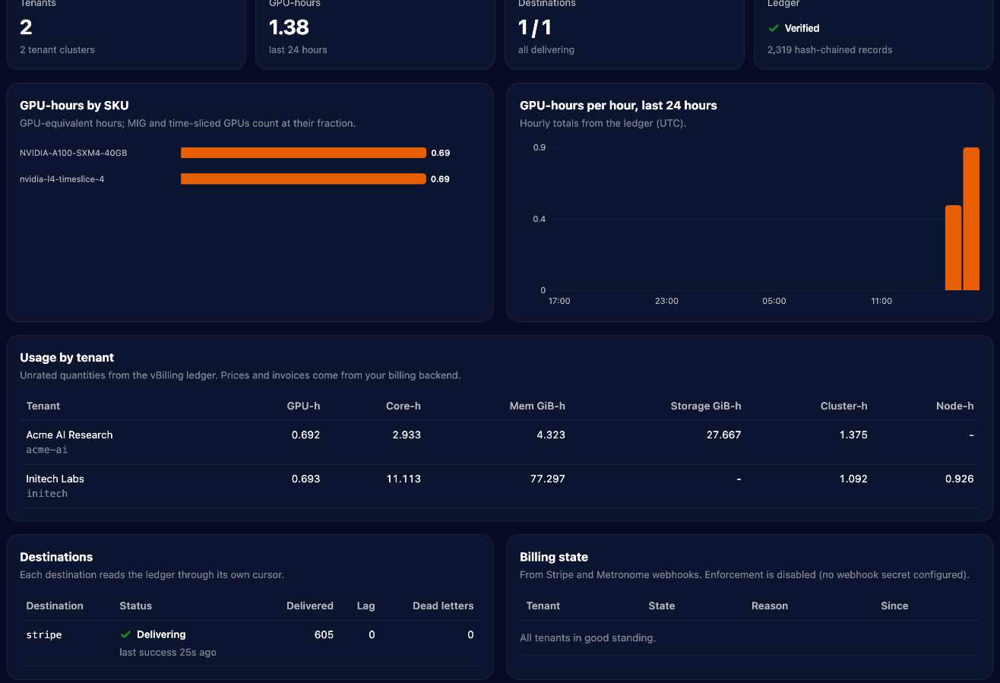

# Example: GKE with shared and private GPU nodes, billed in Stripe

A complete setup with both vCluster tenancy models on GPUs, metered by vBilling and invoiced by Stripe test mode:

- **GKE** as the control plane cluster, with a spot L4 node pool time-shared four ways.
- **`shared-l4`**, a tenant cluster on shared nodes: its pods run on the L4 and are billed per pod, a quarter GPU each.
- **`private-a100`**, a tenant cluster with private nodes: an A100 VM joins it directly and is billed whole, read through the tenant cluster's own API with a read-only kubeconfig.
- **Prometheus** reading DCGM: GKE's exporter on shared nodes, and a Prometheus agent that remote-writes from the private node.
- **vBilling** sending usage to Stripe: customers, one meter per metric and SKU, subscriptions, invoices.

The walkthrough is also on the docs site: [Example: GKE with GPUs](https://vclusterlabs-experiments.github.io/vbilling/example-gke.html).

| File | What it is |
|---|---|
| `01-prometheus.yaml` | Central Prometheus: scrapes GKE's DCGM exporter, accepts remote writes |
| `02-tenant-shared.yaml` | `vcluster.yaml` for the shared-nodes tenant cluster |
| `03-tenant-private.yaml` | `vcluster.yaml` with Private Nodes and the read-only `vbilling-kubeconfig` export |
| `04-node-startup.sh` | VM startup script that joins the GPU machine as a private node |
| `05-gpu-operator-values.yaml` | NVIDIA GPU Operator inside the private tenant cluster |
| `06-prometheus-agent.yaml` | Prometheus agent in the private tenant cluster, remote-writing DCGM |
| `07-vbilling-values.yaml` | vBilling Helm values: Stripe, DCGM queries, a PromQL billable metric |
| `workloads/` | Sample GPU workloads for each tenant cluster |

No file here contains a key, token or account ID. Keep yours out of the repository too: the Stripe key goes into a Kubernetes Secret from a local file, and the node join token only into the VM's metadata, removed after the join.

## Prerequisites

- `gcloud` with a project selected, `kubectl`, `helm`, and the `vcluster` CLI (0.36 or later).
- **vCluster Platform** for the Private Nodes license. The CLI must be logged in with a key that can register tenant clusters. A scoped key fails with `denied by loft access key scope`. vCluster 0.36.2 and later need Platform 4.11.3 or later.
- A **Stripe test-mode** secret key (`sk_test_...`) saved in a local file, for example `~/.stripe-test-key`.
- GPU quota in the zone: one L4 and one A100 (spot capacity is enough).

```bash
export ZONE=us-central1-a CLUSTER=vbilling-demo
git clone https://github.com/vClusterLabs-Experiments/vbilling && cd vbilling/examples/gke-gpu
```

## 1. Control plane cluster

```bash
gcloud container clusters create $CLUSTER --zone $ZONE --release-channel regular \
  --machine-type e2-standard-4 --num-nodes 2
gcloud container node-pools create l4-spot --cluster $CLUSTER --zone $ZONE \
  --machine-type g2-standard-8 --spot --num-nodes 1 \
  --accelerator type=nvidia-l4,count=1,gpu-driver-version=default,gpu-sharing-strategy=time-sharing,max-shared-clients-per-gpu=4 \
  --node-labels vbilling.vcluster.com/capacity-type=spot
gcloud container clusters get-credentials $CLUSTER --zone $ZONE
```

## 2. Prometheus

```bash
kubectl apply -f 01-prometheus.yaml
INGEST_IP=$(kubectl -n monitoring get svc prometheus-ingest -o jsonpath='{.status.loadBalancer.ingress[0].ip}')
```

## 3. Tenant clusters

```bash
vcluster platform login https://<your-platform-host>      # browser login; no key on the command line
vcluster create shared-l4 -n shared-l4 -f 02-tenant-shared.yaml --connect=false
vcluster create private-a100 -n private-a100 -f 03-tenant-private.yaml --connect=false
```

When the CLI is logged in, `vcluster create` registers each tenant cluster with the Platform, which is what licenses Private Nodes. A tenant cluster created before logging in is registered with `vcluster platform add vcluster private-a100 -n private-a100 --project default`.

Tell vBilling who the tenants are. The emails use the reserved `.example` domain:

```bash
kubectl annotate ns shared-l4 vbilling.vcluster.com/tenant=acme-ai "vbilling.vcluster.com/display-name=Acme AI" \
  vbilling.vcluster.com/email=billing@acme-ai.example vbilling.vcluster.com/plan=gpu-cloud
kubectl annotate ns private-a100 vbilling.vcluster.com/tenant=initech "vbilling.vcluster.com/display-name=Initech" \
  vbilling.vcluster.com/email=billing@initech.example vbilling.vcluster.com/plan=gpu-cloud
```

## 4. A private GPU node

```bash
vcluster connect private-a100 -n private-a100 -- vcluster token create --expires 2h | grep node/join > join.txt
awk -v cmd="$(cat join.txt)" '$0 == "JOIN_COMMAND" { print cmd; next } { print }' 04-node-startup.sh > startup.sh
gcloud compute instances create gpu-node-1 --zone $ZONE --machine-type a2-highgpu-1g \
  --provisioning-model SPOT --instance-termination-action STOP --maintenance-policy TERMINATE \
  --image-family ubuntu-2204-lts --image-project ubuntu-os-cloud --boot-disk-size 150GB \
  --no-service-account --no-scopes --metadata-from-file startup-script=startup.sh
```

Once `gpu-node-1` is Ready in the tenant cluster, remove the token from the instance and from disk, and label the node so it gets an SKU:

```bash
gcloud compute instances remove-metadata gpu-node-1 --zone $ZONE --keys startup-script
rm join.txt startup.sh
vcluster connect private-a100 -n private-a100 -- kubectl label node gpu-node-1 \
  node.kubernetes.io/instance-type=a2-highgpu-1g vbilling.vcluster.com/capacity-type=spot
```

## 5. GPU Operator and DCGM in the private tenant cluster

```bash
helm repo add nvidia https://helm.ngc.nvidia.com/nvidia && helm repo update
vcluster connect private-a100 -n private-a100 -- \
  helm install gpu-operator nvidia/gpu-operator -n gpu-operator --create-namespace -f 05-gpu-operator-values.yaml
sed "s/PROMETHEUS_INGEST_IP/$INGEST_IP/" 06-prometheus-agent.yaml > agent.yaml
vcluster connect private-a100 -n private-a100 -- kubectl apply -f agent.yaml
```

The driver container compiles for the node's kernel, about five minutes. Optional MIG: label the node `nvidia.com/mig.config=all-1g.5gb`. On Compute Engine the GPU cannot be reset from the guest, so the MIG manager reports `failed` until the VM is rebooted (`gcloud compute instances reset`). A stop and start can move the VM to a GPU without MIG mode.

## 6. vBilling

```bash
kubectl create namespace vbilling
kubectl -n vbilling create secret generic vbilling-stripe --from-file=api-key=$HOME/.stripe-test-key
helm install vbilling ../../deploy/helm/vbilling -n vbilling -f 07-vbilling-values.yaml
vcluster connect shared-l4 -n shared-l4 -- kubectl apply -f workloads/shared-inference.yaml
vcluster connect private-a100 -n private-a100 -- kubectl apply -f workloads/private-training.yaml
```

vBilling creates the Stripe customers and meters on the first windows. Give the meters prices tagged with the plan, then restart vBilling so it subscribes the tenants:

```bash
export STRIPE_API_KEY="$(cat ~/.stripe-test-key)"
curl -s https://api.stripe.com/v1/billing/meters -u "$STRIPE_API_KEY:" | grep -E '"(id|event_name)"'
curl -s https://api.stripe.com/v1/prices -u "$STRIPE_API_KEY:" \
  -d currency=usd -d unit_amount_decimal=220 \
  -d "recurring[interval]=month" -d "recurring[usage_type]=metered" -d "recurring[meter]=<meter id>" \
  -d "product_data[name]=A100 40GB GPU-hour" -d "metadata[vbilling_plan]=gpu-cloud"
kubectl -n vbilling rollout restart statefulset/vbilling
```

## 7. Check it

```bash
kubectl -n vbilling port-forward svc/vbilling 8080:8080 &
# dashboard: http://localhost:8080/
curl -s "localhost:8080/api/v1/events?from=$(date -u +%Y-%m-%dT%H:00:00Z)" | head
curl -s "localhost:8080/api/v1/reconcile?from=<start>&to=<end>"     # ledger vs Stripe, per tenant and metric
```

What one 30 second window looks like:

| Tenant | Metric | Quantity | Why |
|---|---|---|---|
| acme-ai | `vcluster_gpu_hours` (sku `nvidia-l4-timeslice-4`) | 0.004166667 | 2 pods × ¼ GPU × 30 s |
| initech | `vcluster_gpu_hours` (sku `NVIDIA-A100-SXM4-40GB`) | 0.008333333 | the whole A100, also under MIG |
| initech | `vcluster_private_node_hours` (sku `a2-highgpu-1g`) | 0.008333333 | the node, billed whole |
| initech | `vcluster_cpu_core_hours` | 0.1 | all 12 cores |
| initech | `gpu_energy_kwh` | ≈ 0.0015 | ≈ 177 W for 30 s |



If the spot A100 is reclaimed, the window in which the node becomes unreachable bills only the seconds before it, and the rest becomes `vcluster_gpu_downtime_hours` until the node is back.

## Clean up

```bash
gcloud compute instances delete gpu-node-1 --zone $ZONE --quiet
vcluster delete shared-l4 -n shared-l4 --delete-namespace
vcluster delete private-a100 -n private-a100 --delete-namespace
kubectl delete namespace monitoring vbilling    # removes the load balancers and volumes GKE created
gcloud container clusters delete $CLUSTER --zone $ZONE --quiet
```
